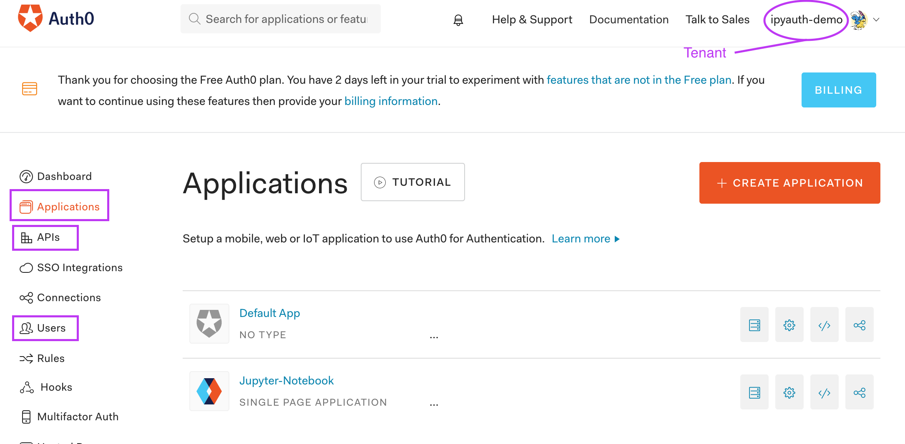
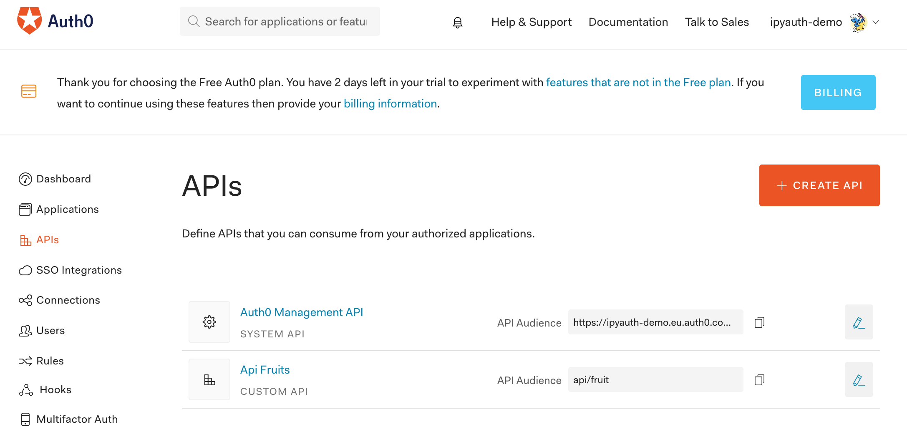

# Auth0

## Overview

To use [Auth0](https://auth0.com/) as an authorisation server you must:
+ Open an account with them - There is a free tier
+ Create an application, an API, and at least a user - see [Config](#config) section
+ This info is necessary to instantiate a `ParamsAuth0` object - see [Params](#params) section

To test it you must:
+ Run the demo API - see [Demo](#demo) section


## Params

The following params are expected to instantiate a `ParamsAuth0` object. Some or all of these params can be made available in a dotenv file. If params are input via the dotenv file and directly, then the latter prevails. 

### response_type

+ type: `string`

This must be `token id_token` as only the implicit flow is supported and the id_token is required for user data.

### domain

+ type: `string`

The Auth0 Domain field.

### client_id

+ type: `string`

The Auth0 Application Client ID field.

### redirect_uri

+ type: `string`

A URI that is listed in an Auth0 Application Allowed Callback URLs.  
**IMPORTANT**: it must be `host:port/callback/` where `host:port` are your notebook servers'.

### audience

+ type: `string`

The Auth0 Name field of an API.

### scope

+ type: `string`
+ default: `profile` and `openid` are automatically added

A space separated list of requested scopes.

### dotenv_folder

+ type: `string`
+ default: `.`

The folder in which a `dotenv_file` may be located.

### dotenv_file

+ type: `string`

The dotenv file name, if any, containing some of the authentication params above.


## Config

Take the following steps to configure Auth0 for the example below:
+ Open an [Auth0](https://auth0.com/) account
+ Create a tenant (i.e. domain)
+ Create at least a user (emails shall be authenticated)
+ Create an application `Juyter-Notebook`
  + Set Allowed Callbacks URLs to `http://localhost:[port]/callback/` (often port=`8888`)
  + Set Allowed Web Origins to `http://localhost:[port]`
+ Create an API `API Fruit`
  + Set identifier to `api/fruit`
  + Set Token Expiration for Browser Flows to say 60 (for fast demo)
  + Create 4 scopes:
    + `read:usual-fruit`
    + `read:exotic-fruit`
    + `write:usual-fruit`
    + `write:exotic-fruit`

Below is a snapshot of the Auth0 admin screen, with the main menus circled in <span style="color: purple">purple</span>.



Below is a snapshot of the API screen.




The purpose of the `API Fruit` is to give access to 2 sets of fruits, usual and exotic, in read only or read/write access. 

Your will be asked to follow a tutorial when you create a new application.  
I found it helpful.


## Example

In this example we are going to tap the protected API configured in the previous section.

See the [demo notebook](https://nbviewer.jupyter.org/urls/gitlab.com/oscar6echo/ipyauth/raw/master/notebooks/demo-ipyauth-auth0.ipynb) for the full example.  

First create a `ipyauth-Autho0-demo.env` file containing at least the following info:

```bash
# file ./ipyauth-Auth0-demo.env
domain=[your-domain].auth0.com
client_id=[your-client-id]
redirect_url=http://localhost:[your-port]/callback/
```

Optionally add the following variables:

```bash
# file ./ipyauth-Auth0-demo.env
audience=api/fruit
requested_scopes=read:usual-fruit write:usual-fruit
```

If these are not present in this file, they can be passed as direct params to the authentication widget. If they are the direct params will override the dotenv file params.

```python
from ipyauth import ParamsAuth0, Auth

p = ParamsAuth0(dotenv_file='ipyauth-Auth0-demo.env',
                audience='api/fruit',
                scope='write:usual-fruit read:exotic-fruit')
a = Auth(params=p)
a
```

After the OAuth2 3-step authentication dance, which:
+ opens a popup window
+ have you input your credentials with the authorisation server
+ redirects you back to the allowed callback url within the popup window
+ then data from the callback is sent back to the parent window and the popup closes

the [JSON Web Token (JWT)](https://auth0.com/docs/jwt) is in the `Auth` object, ready to be used to tap a protected API.

```python
token = a.access_token

# to see the Auth widget variables
a.show()
```

At this stage it is time to start a Auth0 protected demo API. See the [Demo API](#demo-api) section.

You can now make a request:

```python
# extract from demo notebook

import requests as rq

url = 'http://localhost:5000/api/fruit'
headers = {'Authorization': 'Bearer {}'.format(a.access_token)}
r = rq.get(url, headers=headers)
print(r.status_code)
data = json.loads(r.content.decode('utf-8'))
print(data)
```

You can read/write the list of usual fruits, but you can only read the list of exotic fruits. Re-authenticate with different scopes for more/less rights. See the [demo notebook](https://nbviewer.jupyter.org/urls/gitlab.com/oscar6echo/ipyauth/raw/master/notebooks/demo-ipyauth-auth0.ipynb).


## Demo API

### Role

This demo API manages 2 fruit lists:
+ usual fruits
+ exotic fruits

It understands the following scopes:
+ read:usual-fruit to read usual fruits
+ read:exotic-fruit to read usual and exotic fruits
+ write:usual-fruit to add new usual fruits
+ write:exotic-fruit to add new usual and/or exotic fruits

The token is decoded and validated for the scopes, before any info is return or action is taken.  

See the [demo-api](https://gitlab.com/oscar6echo/ipyauth/tree/master/demo-api) folder in the **ipyauth** repo for more details.

### Run

Move to the [demo-api](https://gitlab.com/oscar6echo/ipyauth/tree/master/demo-api) folder:
```bash
# from repo top folder
cd demo-api
```

There are 2 ways to launch the test server.  

#### Python

If you have Python3 and the packages in [requirements.txt](https://gitlab.com/oscar6echo/ipyauth/tree/master/demo-api/requirements.txt) already installed.

```bash
# simple flask
$ python run.py
# or gunicorn
$ gunicorn --config server/conf/gunicorn_conf.py server:app
```

#### Docker

If you have Docker installed.

+ Development mode - Hot reload server upon `src/` folder change

```bash
# build image
$ docker build -t demo-api -f Dockerfile.dev .
# run container
$ docker run --rm -it -p 5000:5000 -v $(pwd)/src:/app/src demo-api bash
# from inside container launch src
root@id:/app# gunicorn --config src/conf/gunicorn_conf.py src:app
```

+ Production mode

```bash
# build image
$ docker build -t demo-api -f Dockerfile.prd .
# run container
$ docker run --rm -it -p 5000:5000 demo-api
```
