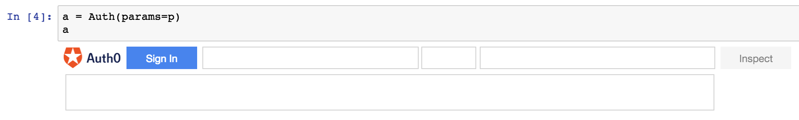
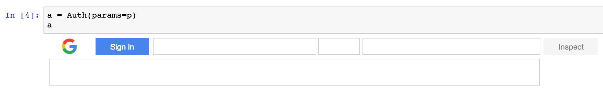
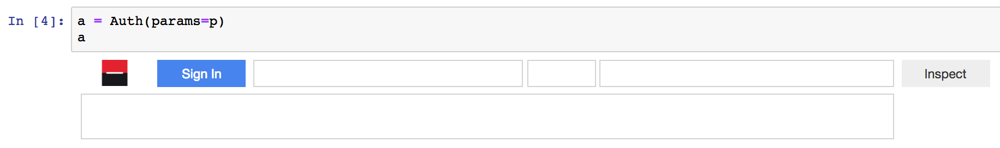
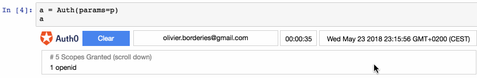

# General

To use **ipyauth** with an anthentication server:
+ create a `Params[IdProvider]` object
+ pass it the the auth widget

Examples:

```python
# Auth0 example
from ipyauth import ParamsAuth0
p = ParamsAuth0(...) # See Auth0 section for details

# Google example
from ipyauth import ParamsGoogle
p = ParamsGoogle(...) # See Google section for details

# SG Connect example
from ipyauth import ParamsSgConnect
p = ParamsSgConnect(...) # See SG Connect section for details

# create auth widget and display it
a = Auth(params=p)
a 
```

For the exact inputs to create the `Params[IdProvider]` object see the relevant sections
+ [Auth0 - Params](./auth0.html#params)
+ [Google - Params](./google.html#params)
+ [SG Connect - Params](./sgconnect.html#params)


Then you should see the widget with the relevant logo. Examples:

+ Auth0:



+ Google:



+ SG Connect:




After authentication the fields contain the:
+ user id
+ token time to expiry, ticking
+ token expiry date
+ scopes granted

For example:



And the `Auth` object contains the same info. This command:

```python
a.show()
```

displays prints something like - comment excluded:

```bash
# BEFORE AUTHENTICATION
# Identity Provider
_type = Auth0
# uuid - used in session storage
_id = Auth0-xtafbo
# user initial input
params = {'_type': 'Auth0', 'dotenv_folder': '.', 'dotenv_file': 'ipyauth-Auth0-demo.env', 'prefix': 'Auth0', 'domain': 'ipyauth-demo.eu.auth0.com', 'client_id': 'Ji3wK7FP8kqK8qa2qBwTDQJR9V50bAxs', 'redirect_uri': 'http://localhost:8888/callback/', 'audience': 'api/fruit', 'scope': 'write:usual-fruit read:exotic-fruit'}

# AFTER AUTHENTICATION
# username
logged_as = olivier.borderies@gmail.com
# time to expiry in HH:MM:SS
time_to_exp = 00:00:53
# expiry date in iso format
expires_at = Sun May 20 2018 17:09:48 GMT+0200 (CEST)
# granted scopes - space separated list
scope = openid profile email write:usual-fruit read:exotic-fruit
# access token - to be used in requests to protected APIs
access_token = eyJ0eXAi(...)MtgMx459uYx47w
```

The inspect button allows to look into the token.  
See the specific ID providers sections for more details.

